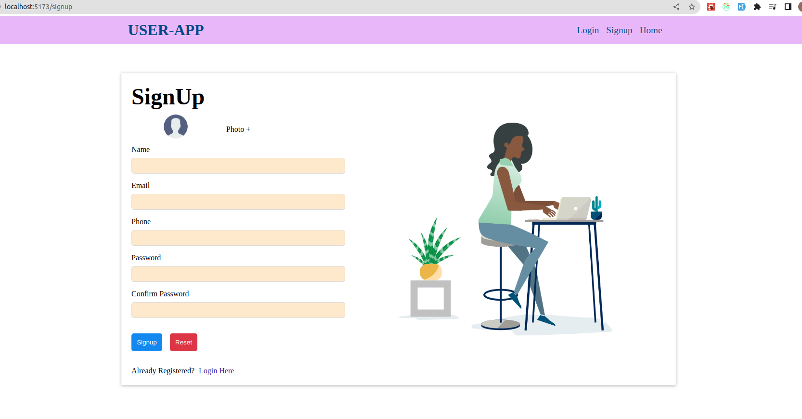
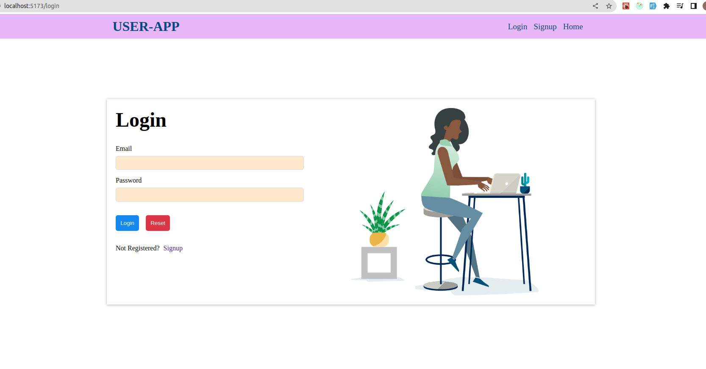
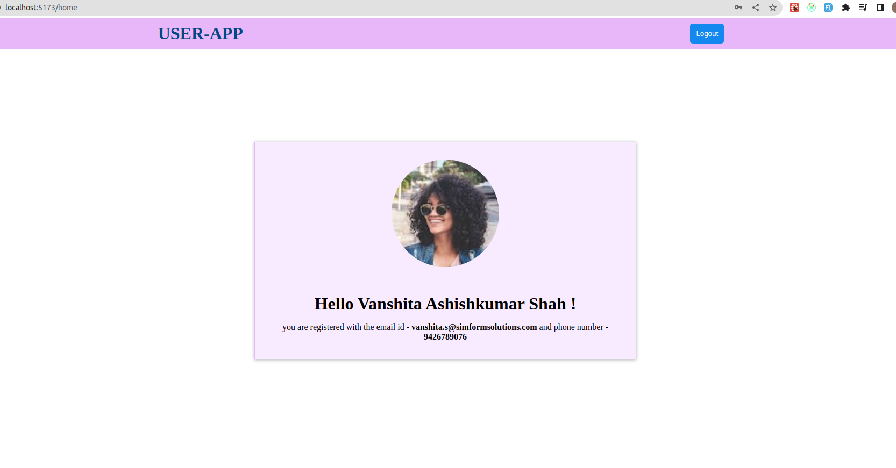

# user-management-app

### Live-link : [https://clever-dolphin-836571.netlify.app/](https://clever-dolphin-836571.netlify.app/)

- In this app, worked on authentication,form validation and Protected Routes.Only authenticated users will be able to access home page containing their profile info.

### Features :

- Add three routes using react-router-dom - /signup, /login and /home
- navigated default "/" route to "/login".
- Used Formik library for handling the following form validations:
  - Name: required, at least 15 char.
  - email: validate email convention, required
  - phoneNo: Indian phone no. is only valid, required
  - password and confirm password should match and also
  - the image should be of type jpg or png, or less than 2Mb
- On pressing submit, validated the entered form details and if valid, save user data to redux store.
- then authenticated users will be navigated to home page ("/home").
- /home - page after login - UI contains profile picture and the following text:
  “Hello {Name}, you are registered with the email id - {Email} and phone number - {PhoneNo}”
  Along with a logout button on the top right.
- On the home page, when the user clicks on the logout button,the saved user data in the redux store will reset and the user will be redirected to the login page.
- If a user tries to access the home page without logging in, redirected to the login page.
  If a user tries to access the signup or login page after logging in, redirected to the home page.
- User can navigate in between login and signup page but can't access home page without logging in.
- Error handling and responsiveness added.

### Components :

- Header : contains navigation bar
- Authentication : Contains Signup and login form, also form-utils for validation and form-level errors
  - Form/LoginForm
  - Form/SignupForm
  - FormError/FormErrors
  - FieldError/ErrorMsg
  - InputField : Reusable component for Fields
- Home : Contains homepage JSX
- ErrorPage : Handles page not found Error

### Folder Structure :

    .
    ├── index.html
    ├── package.json
    ├── package-lock.json
    ├── README.md
    ├── src
    │   ├── App.css
    │   ├── App.jsx
    │   ├── assets
    │   │   ├── favicon.ico
    │   │   ├── home_page.png
    │   │   ├── img.jpg
    │   │   ├── login_page.png
    │   │   ├── preview.png
    │   │   ├── signup_page.png
    │   │   └── signup.png
    │   ├── components
    │   │   ├── Authentication
    │   │   │   ├── Authentication.jsx
    │   │   │   ├── Authentication.module.css
    │   │   │   ├── Form
    │   │   │   │   ├── LoginForm.jsx
    │   │   │   │   └── SignupForm.jsx
    │   │   │   ├── FormUtils
    │   │   │   │   ├── FieldError
    │   │   │   │   │   ├── ErrorMsg.jsx
    │   │   │   │   │   └── ErrorMsg.module.css
    │   │   │   │   ├── FormError
    │   │   │   │   │   ├── FormErrors.jsx
    │   │   │   │   │   └── FormErrors.module.css
    │   │   │   │   └── FormValidations.js
    │   │   │   └── InputField
    │   │   │       └── InputField.jsx
    │   │   ├── ErrorPage
    │   │   │   ├── ErrorPage.jsx
    │   │   │   └── ErrorPage.module.css
    │   │   ├── Header
    │   │   │   ├── Header.jsx
    │   │   │   └── Header.module.css
    │   │   ├── Home
    │   │   │   ├── Home.jsx
    │   │   │   └── Home.module.css
    │   │   └── ProtectedRoutes.jsx
    │   ├── main.jsx
    │   └── store
    │       ├── authSlice.js
    │       └── index.js
    └── vite.config.js

### Git strategy :

- **Feature branches**
  feature/Form-Handling
  feature/Redux
  feature/Routing
  feature/UI
  feature/refactor

- All Merged into **dev** branch
- **dev** Merged into **main** branch

### Snapshots :

- Signup Page

- Login Page

- Home page

